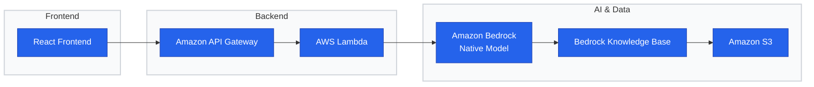

# Helium 10 Automation Agent

## Introduction

This project aims to develop a highly autonomous AI Agent designed to maximize the data value and functional utility of Helium 10. The core objective is to significantly reduce the daily workload of Amazon operators and enhance overall operational efficiency through intelligent automation.

## System Architecture

The system is built on a Serverless architecture leveraging AWS and Amazon Bedrock. The integrated data flow and service connectivity are structured as follows:

Storage Layer (Amazon S3): Serves as the centralized repository for raw data files and the primary source for the business knowledge base.

Knowledge Base Layer (Amazon Bedrock KB): Ingests and processes unstructured data from S3 to provide context-aware retrieval.

Intelligence & Compute Layer (Agent & Lambda): Amazon Bedrock acts as the "core brain" (utilizing Amazon Native Foundation Models). It directly invokes AWS Lambda functions to execute specific automation logic and business tasks.

Gateway Layer (Amazon API Gateway): Bridges the backend logic by exposing Lambda or Bedrock services as scalable RESTful APIs.

Presentation Layer (Front End): A modern web interface that connects to the API Gateway to facilitate seamless end-user interaction.

The following diagram illustrates the serverless data flow and integration between AWS services and the AI Agent.

